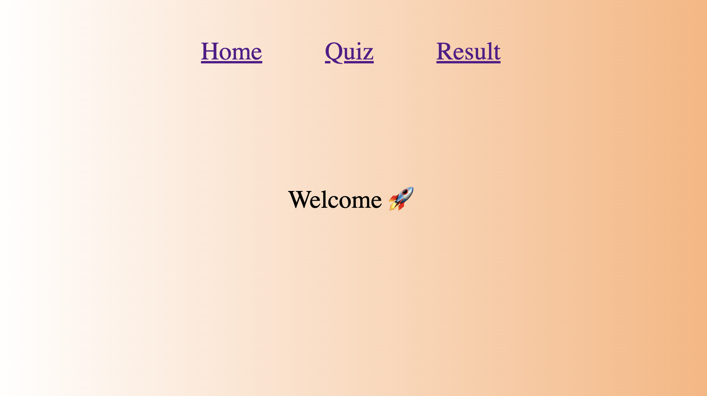
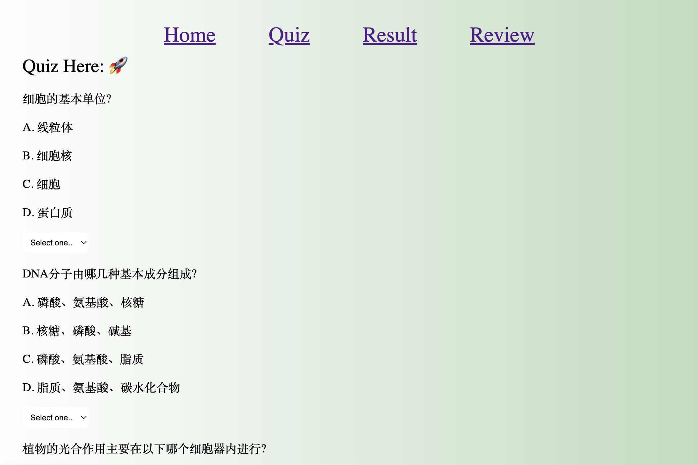
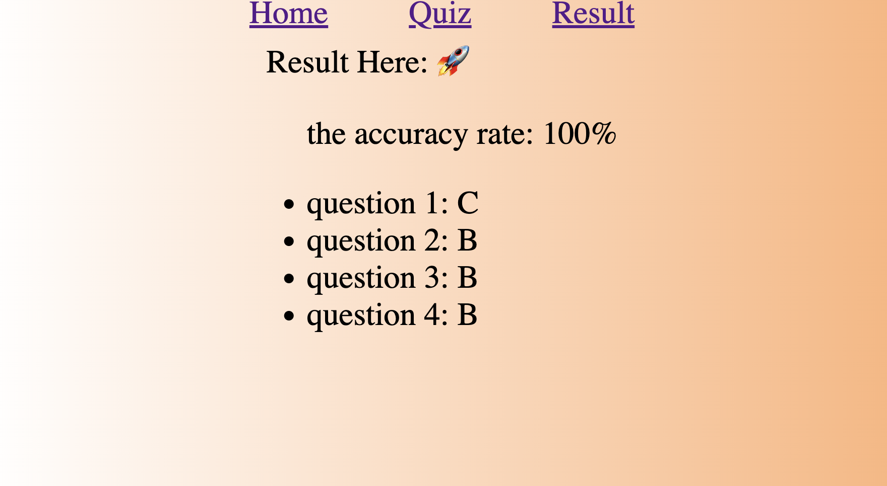

# React + Vite

"This project is a practice exercise."

There are three pages in the projects, home,quiz and result;

For Home page, it looks like this:

For Quiz page, there are four questions (as sample).

After, you finish the quiz, you can get result at result page.

This template provides a minimal setup to get React working in Vite with HMR and some ESLint rules.

Currently, two official plugins are available:

- [@vitejs/plugin-react](https://github.com/vitejs/vite-plugin-react/blob/main/packages/plugin-react/README.md) uses [Babel](https://babeljs.io/) for Fast Refresh
- [@vitejs/plugin-react-swc](https://github.com/vitejs/vite-plugin-react-swc) uses [SWC](https://swc.rs/) for Fast Refresh
# quiz_react_AA
